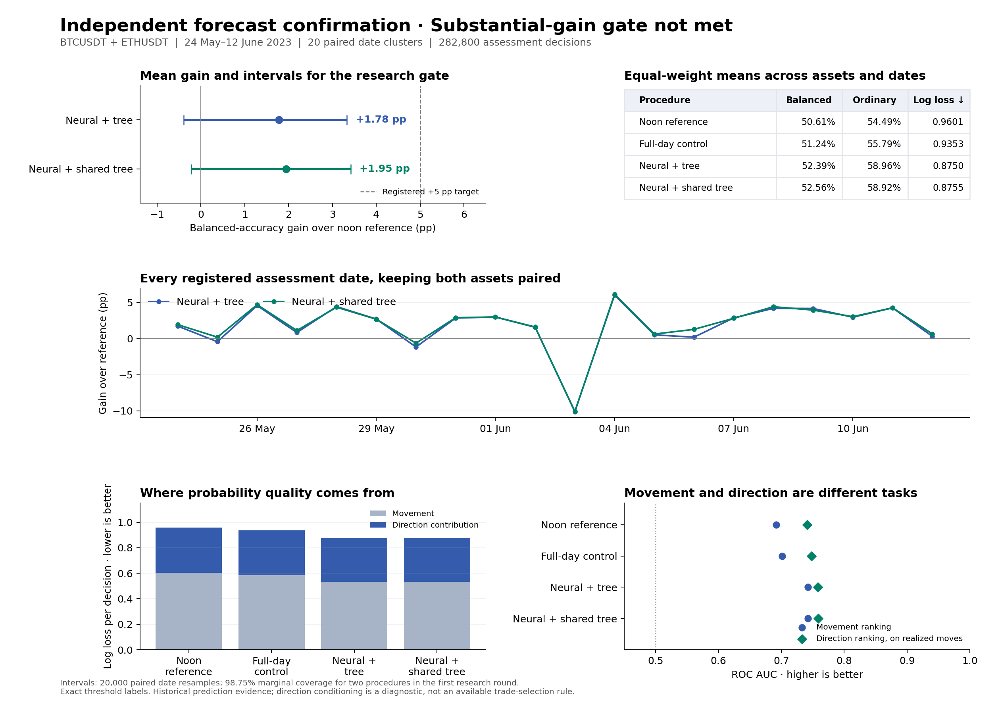

# Predictive boundary research: first independent confirmation

Neither fixed candidate met the substantial-gain gate. The stronger candidate improved balanced accuracy by **1.9481 percentage points** over the original reference, below the registered **5-point** requirement. Its nominal research-budget date interval also includes zero. No model is promoted and no trading-profit claim is made.

The test covers **282,800 decisions**, BTCUSDT and ETHUSDT, and **20 dates from May 24 through June 12, 2023**. Each date has 7,070 decisions per asset from 12:02:00 to before 13:59:50 UTC. The target is an exact-decimal, three-class move between the first raw quote at or after decision +100 ms and the first at or after decision +5,100 ms. Moves exactly at the larger of half the entry spread and one minimum tick are neutral.

| Frozen procedure | Balanced accuracy | Ordinary argmax accuracy | Natural posterior log loss |
|---|---:|---:|---:|
| Original noon-data reference | 50.6085% | 54.4859% | 0.960114 |
| Matched full-day training control | 51.2411% | 55.7910% | 0.935261 |
| Pooled neural / per-asset tree blend | 52.3893% | 58.9632% | 0.874963 |
| Pooled neural / pooled balanced tree blend | **52.5565%** | 58.9236% | 0.875474 |

Means weight each asset/date panel equally. Balanced decisions divide natural probabilities by the procedure's available class-prior estimate. Ordinary accuracy instead uses the argmax of unchanged natural probabilities; these are distinct decisions and metrics.

The stronger balanced candidate gains **1.3154 points** over the matched-data control, so extra training observations do not explain all of the improvement. Its ordinary accuracy gains **4.4378 points** and its log loss falls **8.82%** versus the original reference. Those improvements do not substitute for the balanced-accuracy gate.

## Uncertainty and integrity

The pooled-tree blend's original paired-date 95% interval is **[+0.3137, +3.1425] points**. Under the additional continuing-research error budget, its **98.75% marginal interval is [-0.2226, +3.4175] points**. A three-day circular-block sensitivity interval at that coverage is **[+0.2149, +3.1334] points**. The assets remain paired within each sampled date. These bootstrap intervals rely on coverage assumptions; the nominal allocation does not establish validity under arbitrary regime dependence.

Both candidates improved in each asset and passed the log-loss and date-count conditions. Both failed the 5-point effect-size condition and the stricter date-interval condition. The gate and its earlier, less stringent analyses are preserved rather than replaced after seeing results.

All 80 newly acquired source ZIPs match official SHA256 values. Corrected labels preserve all observed fields and raw quote-resolution timestamps. All primary predictions were frozen before inspection; the secondary procedure was registered before primary scores were read. The secondary array/dictionary compatibility failure is preserved and its identical mathematical restart is documented. Completed fits total 340 primary plus 20 secondary, with one failed secondary training attempt counted separately.

The [evidence JSON](boundary_confirmation_evidence_20260907.json) is byte-identical to the complete two-procedure summary: SHA256 `acbd8312944d068dd8599a2c86634822425602fcd9a0b63dd93b004f7a826325`. The [research gate result](boundary_research_gate_result_20260907.json), [diagnostics](boundary_confirmation_diagnostics_20260907.json), and [exposure ledger](boundary_confirmation_exposure_20260907.json) preserve the other claims. Raw sources and checkpoints remain local and ignored by Git.

## What the forecasts learned

Movement-versus-neutral AUC rises from **0.6915 to 0.7422**. Direction AUC conditional on a realized move rises from **0.7409 to 0.7584**. About **86.8%** of the log-loss improvement comes from movement-versus-neutral prediction. The conditional direction diagnostic uses future outcomes to define its evaluation population; it is not an available trade-selection rule.

The exact per-panel identity is:

    three-class log loss
      = movement binary log loss
      + realized movement fraction * conditional direction log loss

The aggregate uses the mean of the per-panel direction contribution, not a product of separately averaged quantities. Shared probability flooring preserves the decomposition, including predictions with zero components.

June 3 accounts for the largest balanced-decision failure. The stronger blend is **10.1327 points below** the original reference that day, although its ordinary accuracy and log loss improve. Its confusion matrices show excess neutral decisions in a quiet regime. This makes available class-frequency estimation a concrete next hypothesis, without establishing that frequency adjustment must help under every distribution shift.

## Subsequent development experiment

After exposing these results, a separate fixed family tested **1,760 post-fit source/policy trials**: four frozen forecast sources, eleven prior policies, and forty asset/date panels. The policies use only labels released by the actual future quote, or current and earlier forecast probabilities. All natural probabilities, ordinary argmax accuracies and log losses remain unchanged. Prefix-causality and exact released-observation weighting tests pass.

The strongest development combination is the original neural/tree blend with a one-hour exponential marginal forecast estimate initialized from available same-day labels. Its balanced accuracy is **53.5694%**, or **+2.9610 points** versus the original registered reference and **+1.9602 points** versus the matched-data control with the same policy. June 3 balanced accuracy is **61.5059%**, versus **45.2979%** for that blend's original rule. Faster adaptation is often harmful, and improving one failure date does not establish broad substantial gain.

The [prior-study protocol](boundary_same_day_priors_20260907.json) and [all forty-four aggregate combinations](boundary_same_day_priors_evidence_20260907.json) record this exploratory result. The May 24–June 12 dates are now development data and cannot count again as unseen confirmation. A selected rule must be fixed before a new independent round. The research objective remains active, with predictive accuracy first and economic evaluation later.
